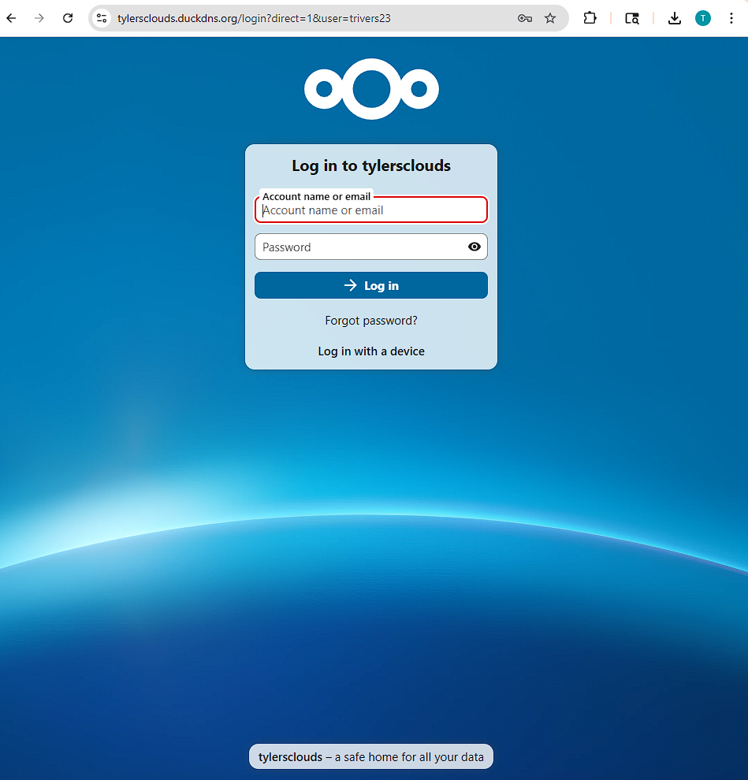
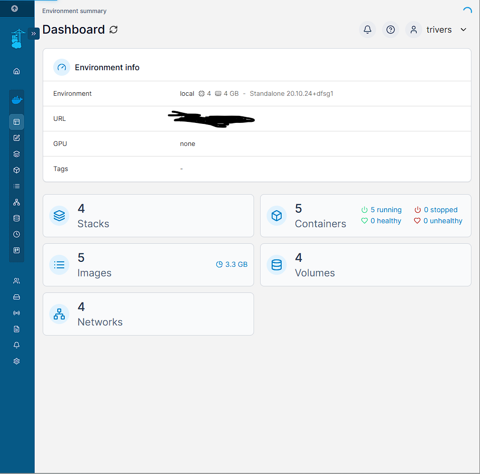

# ☁️ Nextcloud Docker Setup with NGINX Proxy Manager

This repository documents the setup of a secure self-hosted [Nextcloud](https://nextcloud.com) server using Docker Compose and HTTPS via **NGINX Proxy Manager**. This is ideal for Raspberry Pi, home servers, or small business environments.

## ✅ Features

- Nextcloud with persistent storage
- NGINX Proxy Manager for HTTPS with Let's Encrypt
- MariaDB as backend database
- Redis cache for improved performance
- Optional monitoring tools (Grafana/Promtail)

## 📖 Documentation

- [Setup Instructions](setup-instructions.md)
- [Troubleshooting Guide](troubleshooting.md)

## 🖥 Screenshots

### 📁 Nextcloud Web Interface

(nextcloud-dashboard.png)
### 🔐 NGINX Proxy Manager Setup

### 🐳 Portainer Container Dashboard

